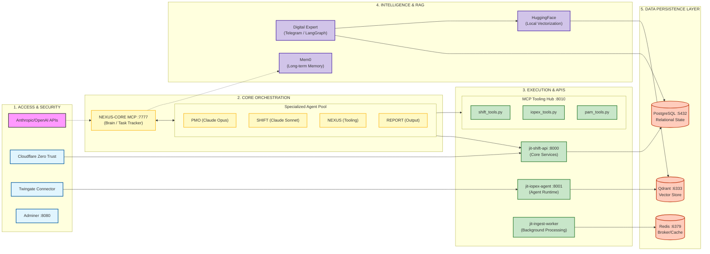

# iOPEX x NEXUS-CORE Architecture (v2)

This version provides a highly legible, landscape-oriented architectural view designed for clarity and spatial efficiency.

## Overview

The Nexus-Core infrastructure is a modular, agentic ecosystem centered around the Model Context Protocol (MCP). It partitions logic into five distinct horizontal tiers: **Access/Ingress**, **Orchestration**, **Execution**, **Intelligence (RAG)**, and **Persistence**.

## Landscape Architecture Diagram

## Detailed Component Breakdown

### **1. Access & Security**
- **Cloudflare Zero Trust / Twingate**: Secure tunneling for remote access without exposing ports to the public internet.
- **Adminer**: Web UI for database management.

### **2. Core Orchestration**
- **Nexus-Core MCP (7777)**: The central "state machine." Tracks task lifecycles, ledger entries, and cross-agent coordination.
- **Agent Pool**: Functional roles powered by specific Claude models (Opus for high-level planning, Sonnet for code/technical execution).

### **3. Execution & APIs**
- **jit-shift-api (8000)**: The primary REST interface for internal platform operations.
- **jit-iopex-agent (8001)**: The runtime environment where agents actually execute their logic.
- **MCP Hub (8010)**: A centralized tool repository that exposes Python scripts as standardized capabilities (tools) to any connecting agent.

### **4. Intelligence & RAG**
- **Digital Expert**: A complex workflow using **LangGraph** to handle multi-step reasoning.
- **HuggingFace**: Runs local embedding models to avoid sending raw data to external providers for vectorization.
- **Mem0**: A persistence layer for user preferences and past interaction memory.

### **5. Data Persistence**
- **PostgreSQL**: The source of truth for all relational data (users, tasks, logs).
- **Redis**: Facilitates fast communication between the API and background workers (Celery).
- **Qdrant**: High-performance vector database for retrieving contextually relevant documents and information.
